# Preliminary review

Viewing the data for some files before determining features.

Game file used is `stratus_log_pf_roblox_1720126745.txt`

Non-game file used is `stratus_log_writing_lecture_notes_1719869300.txt`

## Scaled x-pos

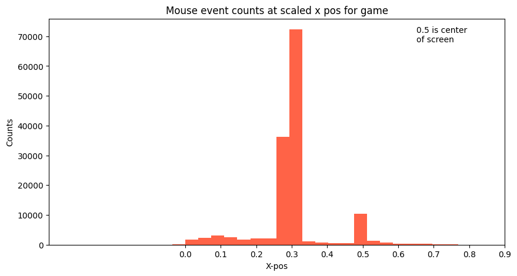

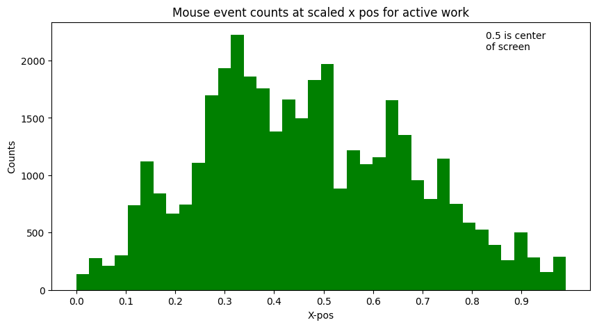

## Scaled y-pos

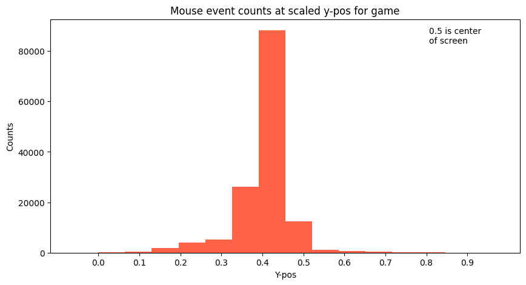

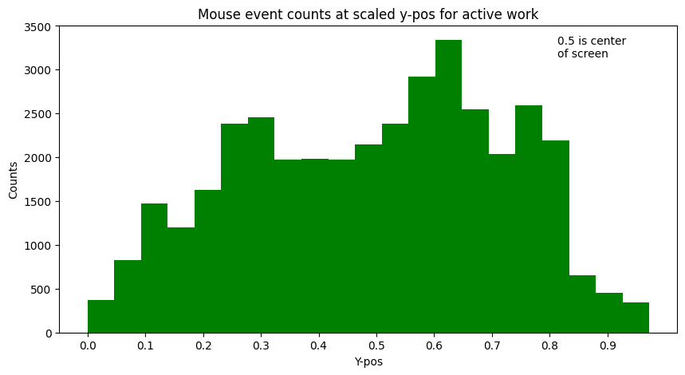

## Percentage of time each mouse button was held

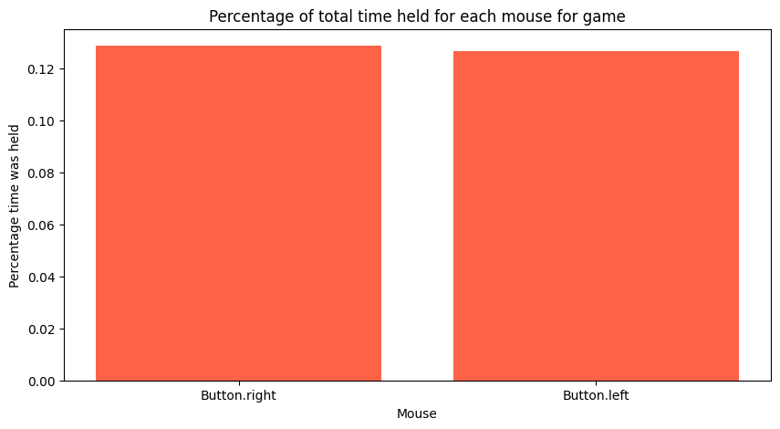

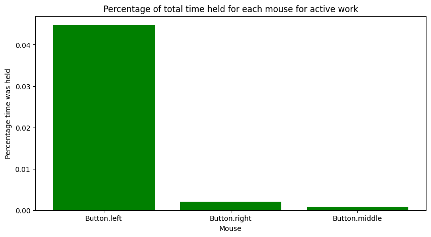

## Mouse up counts per minute for each mouse button

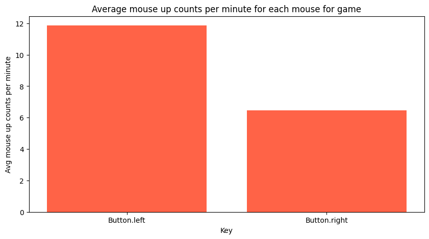

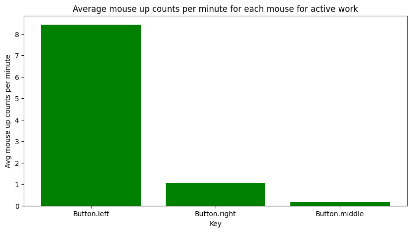

## Percentage of time key was held

Only the top 10 most held keys were shown. The graph rapidly taper off near the
end

Notice very high percentage of time held for keys used in games. "w" is held
more than 100% of the time, although this can be attributed to errors in the
recording software.

In addition, the plot for active work is more uniform than the plot for playing
games.

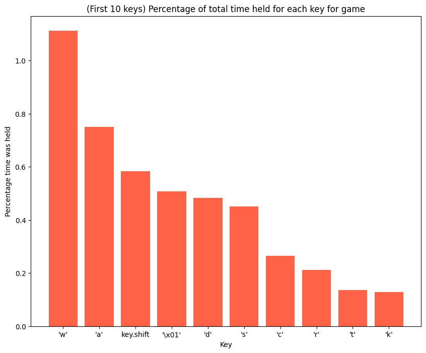

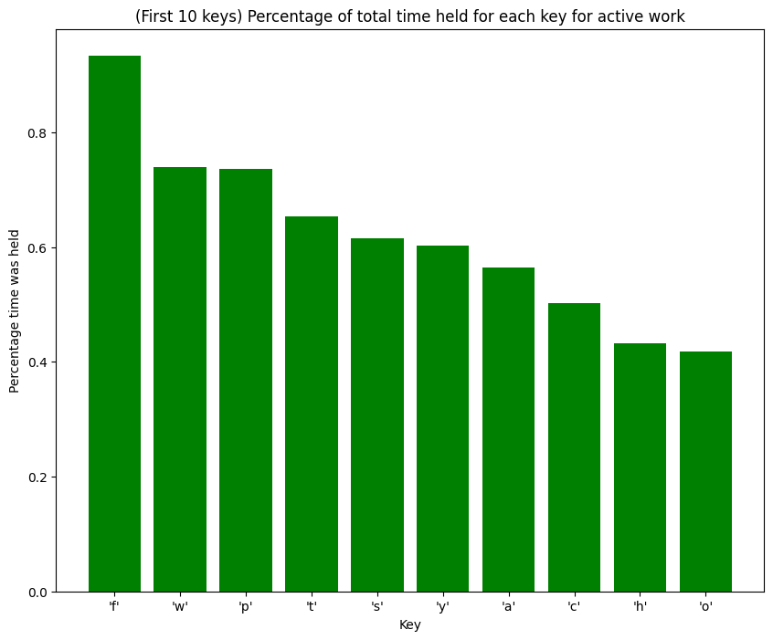

## Average key up counts per minute for each key

Only the top 10 most pressed keys were shown.

Notice that for games, the first few keys are frequently pressed, but there is a
large drop off after the first six keys. The first six keys correspond to
movement in the game, which explains why they are pressed the most.

On the other hand, for active work, the plot is mostly uniform, except for a
spike for the top three most pressed keys. These keys include backspace and
space, which are frequently used when writing. "t" is also one of the most
common letters in English, which also explains why it is one of the most pressed
keys.

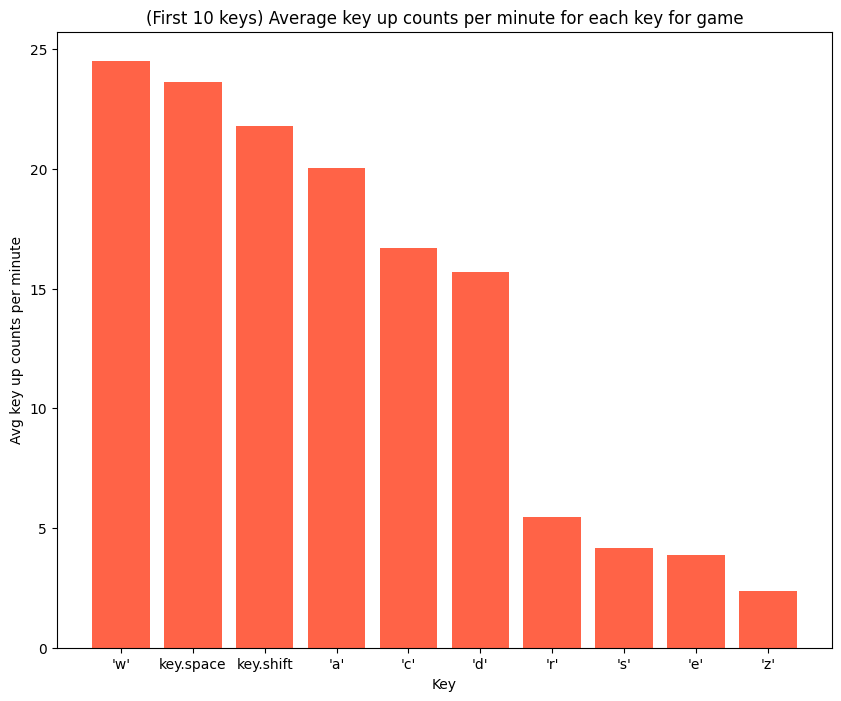

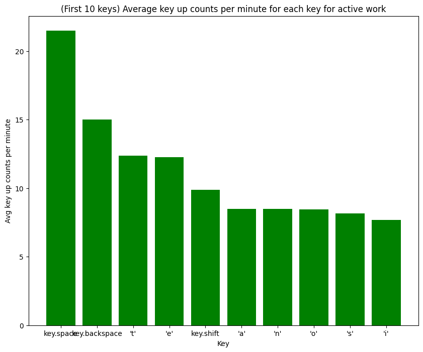

# Features that the AI is trained on

Each data point is one minute from one of the data sets.

- Mean mouse x pos
- Mean mouse y pos
- Stdev of mouse x pos
- Stdev of mouse y pos
- Percentage of time held for
  - Left mouse
  - Middle mouse
  - Right mouse
- Number of mouseups per minute for
  - Left mouse
  - Middle mouse
  - Right mouse
- How many keys make up 25% of all the time keys were held
  - Justification: Active work is more uniform, so more keys make up 25%
  - If 100% uniform, 25% of the top most held keys would make up 25% of all keys
    that detected input
  - How many keys make up 25% of all the key up counts
  - Justification: Active work is more uniform, so more keys make up 25%
- How many keys make up 25% of all the key up counts ONLY LETTERS

  - Justification: Active work is more uniform, so more keys make up 25%
  - Only letters because if we look on the active work graph, only letters is
    pretty uniform, unlike games

- Movement keys to Non-movement keys hold time ratio
  - Justification: A measure of how much WASD, space, shift, and arrow keys are
    held compared to other keys. These keys are most used in games for movement,
    and so these keys are likely most held compared to other keys. This does not
    work for text based games or games that don't use a mouse.